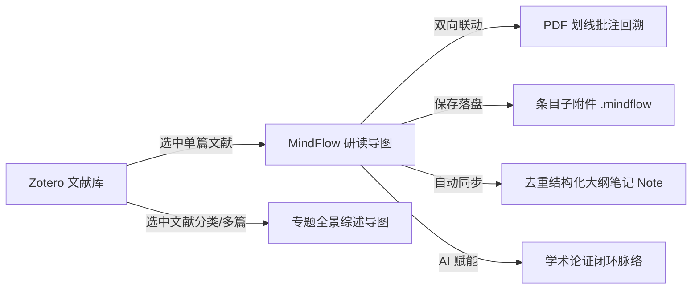

# MindFlow for Zotero

<div align="center">


# MindFlow for Zotero
### 专为学术科研打造的高颜值全功能思维导图与文献伴读插件

**English** | [简体中文](README.md) • [English Documentation](README_EN.md)

[](https://github.com/groele/Mindflow-zotero)
[](zotero/manifest.json)
[](package.json)
[](tsconfig.json)
[](scripts/build-zotero.mjs)
[](LICENSE)

[快速安装](#-安装与快速上手) • [v200 重大更新](#-v200-重大版本升级) • [核心功能矩阵](#-核心特性矩阵) • [科研工作流](#-典型学术科研工作流) • [存储与同步架构](#-存储与同步安全架构) • [AI 论文导图](#-ai-论文研读导图) • [快捷键指南](#-全键盘高效快捷键) • [源码构建](#-从源码构建)

</div>

---

## 📖 项目简介

**MindFlow for Zotero** 是一款深度无缝嵌入 **Zotero 10** 生态的现代知识管理与可视化文献研读工具。

在传统学术阅读中，文献题录、PDF 高亮批注与长篇读书笔记往往分散在各个面板中，难以形成宏观的知识脉络与逻辑体系。**MindFlow** 将文献元数据（作者、年份、DOI）、论文核心摘要、PDF 关键划线与批注笔记自动化汇聚为直观清晰、自由推演的层级思维导图：
- 导图源文件直接作为目标文献条目的**直接子附件**（`.mindflow` 文件，与 PDF 平级保存）；
- 每次归档同步生成排版纯净的**结构化大纲富文本子笔记**（Note）；
- 支持点击批注节点一秒穿梭回溯原 PDF 页面高亮位置；
- 内置 AI 深度论文研读引擎，全方位赋能学术精读、文献综述与知识沉淀。

---

## 🚀 v2.0.0 重大版本升级

作为 MindFlow 发展史上的里程碑更新，`v2.0.0` 带来了架构级革新与全流程体验纯化：

### 1. 🎨 全新 MapGraph (星轨拓扑) 品牌标志
- 采用微渐变白底高透毛玻璃质感底座，嵌入湛蓝核心知识中枢与八向星轨多维分支；
- 经过高精度亚像素超采样距离场（SDF）抗畸变渲染，在 Zotero 浅灰工具栏 **16×16 极小尺寸** 下依然锐利锋芒、层次分明。

### 2. 🛡️ 子附件存储与灾备高可用架构
- **条目级直接子附件**：彻底解决导图文件未能正确保存在目标文献下的缺陷，导图 `.mindflow` 严格以文献子附件形式（与 PDF 同级）归档；
- **三重灾备安全机制**：导图写入本地数据目录 `mindflow/workspace/`，通过**临时文件替换原子落盘**、**写后自检回读校验**及 **`.bak` 历史镜像留存**，保障科研成果永不丢失；
- **真实保存反馈**：宿主通道与物理磁盘落盘完成前不误报“已保存”，杜绝内存状态伪保存风险。

### 3. 💡 附属文献笔记 (Note) 摘要纯化与去重
- **消除双重摘要冗余**：彻底修复旧版大纲笔记中根标题与子节点各打印一份摘要的重复混乱问题；
- **结构化独立收拢**：根节点专注文献标题与元数据，全文摘要规范归入专属的 `💡 核心摘要` 独立分支；
- **大纲预览智能过滤**：自动过滤大纲中嵌套子预览的重复输出，生成的 Zotero 子笔记条目脉络清晰、紧凑规整。

### 4. 📑 多标签页深度隔离防串台
- 基于文献条目专属 URI 与 Reader 标签页建立严格的上下文状态机；
- 彻底解决在不同文献切换打开导图时错误串台、覆盖历史导图的重大逻辑隐患。

### 5. 🖋️ 导图卡片排版与长文献标题优化
- 根节点卡片最大宽度扩展至 520px，长篇顶会顶刊学术论文标题完整优雅展示；
- 移除挤占标题空间的标签胶囊与多余的标签分支，专注科研核心逻辑。

---

## ✨ 核心特性矩阵

| 功能模块 | 特性描述 | 优势与价值 |
| :--- | :--- | :--- |
| **Zotero 原生集成** | 工具栏图标、文献列表右键菜单、Reader 阅读器顶部菜单、条目右侧栏全面嵌入 | 无缝融入日常 Zotero 研读流程，无需跳出主工作环境 |
| **全键盘极速导图** | `Tab` 添加子节点、`Enter` 添加同级节点、`Space` 极速编辑，100% 键盘盲操 | 思考不被打断，极速捕捉论文灵感火花 |
| **PDF 双向瞬移** | 批注节点保留原始 PDF 页码与高亮锚点，点击节点一键在 Zotero 阅读器中精准定位 | 论点与原文证据链紧密交织，随时回溯学术语境 |
| **多元结构化呈现** | 支持经典思维导图（左右平衡）、向右逻辑图、向下组织图等多种布局 | 适配文献精读、实验设计、综述演变等多样化场景 |
| **AI 论文深度研读** | 兼容 OpenAI / DeepSeek / Claude 等主流大模型协议，支持快速提炼与分段长文精读 | 自动生成包含“核心问题 $\to$ 实验方法 $\to$ 关键证据 $\to$ 局限”的严谨导图 |
| **多维度导出能力** | 支持导出 `.mindflow`、JSON、Markdown、OPML、PNG、SVG 及交互式独立 HTML | 便捷导入 Obsidian、Notion 或在学术报告中投影演示 |
| **安全三层备份** | 本地原子工作区 + Zotero 文献子附件漫游 + 独立 WebDAV / 完整快照归档 | 抵御意外断电、崩溃与跨设备迁移冲突 |

---

## 📥 安装与快速上手

### 环境准备
- 适用于 **Zotero 10.0.x**（Windows / macOS / Linux）。

### 安装步骤
1. 前往 GitHub [Releases](https://github.com/groele/Mindflow-zotero/releases) 下载最新版本的发行包：
   ```text
   mindflow-zotero-2.0.0.xpi
   ```
2. 打开 Zotero 10，点击顶部菜单栏 **工具 → 附加组件 (Tools → Add-ons)**；
3. 点击附加组件管理器右上角的 **齿轮设置图标**，选择 **从文件安装附加组件 (Install Add-on From File...)**；
4. 选中已下载的 `mindflow-zotero-2.0.0.xpi` 并确认安装；
5. **重启 Zotero** 即可享受全新体验。

### 入口快速调用
- **主工具栏**：点击主界面顶部工具栏的 MapGraph 星轨图标；
- **右键菜单**：在文献列表中右键任意条目 $\to$ 选择 **MindFlow → 为所选文献生成/打开思维导图**；
- **详情侧栏**：点击右侧条目详情面板中的 **MindFlow 导图** 分区；
- **全局快捷键**：按下 `Ctrl+Alt+M` (macOS 为 `Cmd+Alt+M`)。

---

## 🔄 典型学术科研工作流



### 工作流 1：单篇文献精读与批判性思维构建
1. 在 Zotero 选中一篇文献，右键选择 **MindFlow 导图**；
2. 插件自动读取作者、期刊、DOI、核心摘要与所有 PDF 划线批注，生成骨干脉络；
3. 根据个人理解调整子主题，拖拽连接建立交叉关联线；
4. 点击批注节点上的 `[链接]`，即刻弹开 PDF 并精准高亮到文献对应行；
5. 按下 `Ctrl+S`，文件自动归档为该文献的子附件。

### 工作流 2：多文献横向综述与专题证据链整合
1. 选中某一分类下的多篇同主题文献，点击 MindFlow 生成专题导图；
2. 系统自动以对比矩阵形式罗列各文献分支，且各节点均携带回溯原文献的跳转锚点；
3. 导图统一沉淀至个人库的 `MindFlow｜独立导图` 集合容器，不污染单篇文献附件结构。

### 工作流 3：AI 深度辅助论文精读
1. 在 **设置 → MindFlow → AI 论文研究导图** 填入 API 接口地址与 Key；
2. 右键论文选择 **AI 解析论文并生成研究导图**；
3. 本机快速提取 PDF 关键章节与数据，预览发送范围并由您自主审核脱敏；
4. 生成涵盖“已有问题 $\to$ 核心假设 $\to$ 方法创新 $\to$ 证据链 $\to$ 局限”的学术论证闭环导图。

---

## 🔒 存储与同步安全架构

MindFlow 摒弃脆弱的单纯内存缓存，建立严密的**三层工业级存储架构**：

| 存储层级 | 存储载体与路径 | 作用与机制 | 跨设备漫游方式 |
| :--- | :--- | :--- | :--- |
| **第一层：本地工作区** | `[ZoteroData]/mindflow/workspace/` | 临时文件原子写入、写后校验、自动保留 `.bak` 镜像 | 本机极速缓存与防崩灾备 |
| **第二层：文献子附件** | 文献条目下的 `.mindflow` 文件 (与 PDF 平级) | 真正的文献级知识资产，与文献强绑定 | 随 Zotero 官方文件同步（Zotero Storage 或 WebDAV）自动漫游 |
| **第三层：结构化笔记** | 文献条目下的 HTML 富文本子笔记 | 去重后的文字提纲，可全文检索 | 随 Zotero 条目数据同步自动漫游 |

---

## ⌨️ 全键盘高效快捷键

| 快捷键 | 功能说明 | 快捷键 | 功能说明 |
| :--- | :--- | :--- | :--- |
| `Tab` | 插入子级节点 | `Enter` | 插入同级节点 |
| `Space` / 双击 | 快速进入节点编辑状态 | `Delete` / `Backspace` | 删除当前选中节点 |
| `Ctrl/Cmd + S` | 立即保存并归档到文献 | `Ctrl/Cmd + Z` / `Y` | 撤销 / 重做 |
| `Ctrl/Cmd + F` | 全局节点搜索与批量替换 | `Ctrl/Cmd + K` | 呼出全局快速命令面板 |
| `Ctrl/Cmd + 1` | 视口居中并适应全部节点 | `Ctrl/Cmd + 0` | 重置缩放比例至 100% |
| `F11` | 沉浸式全屏学术专注模式 | `Ctrl/Cmd + Alt + M` | Zotero 主界面调起 MindFlow |

---

## 🛠️ 从源码构建

本项目采用 **Vite + React 19 + TypeScript + Tailwind CSS** 前端架构，并通过专属 Node.js + PowerShell 管道打包出符合 Mozilla Gecko 规范的 IIFE 插件包。

### 1. 环境准备
- Node.js >= 18.0.0
- npm >= 9.0.0
- PowerShell 7 (`pwsh`)

### 2. 编译与打包
```powershell
# 克隆代码仓库
git clone https://github.com/groele/Mindflow-zotero.git
cd Mindflow-zotero

# 安装项目依赖
npm ci

# 执行 Zotero Gecko IIFE 编译与 XPI 打包
npm run build:zotero
```

打包完成后，安装包将生成至：
```text
dist-zip/mindflow-zotero-2.0.0.xpi
```

---

## ❓ 常见问题排查 (FAQ)

<details>
<summary><b>Q1: 安装插件后找不到 MindFlow 入口？</b></summary>
请确认使用的是 Zotero 10.0.x 版本；安装 XPI 后必须完全重启 Zotero。选中常规文献条目后右键菜单将出现 MindFlow 选项。
</details>

<details>
<summary><b>Q2: 导图大纲笔记中是否还会出现两份摘要？</b></summary>
v2.0.0 版本已彻底重构大纲渲染算法，根节点不再附加重复全文摘要，摘要统一归入“核心摘要”专属子分支，无论新建还是同步旧导图均仅保留一份清晰摘要。
</details>

<details>
<summary><b>Q3: 新换了电脑，如何同步我之前的思维导图？</b></summary>
只要您的 Zotero 配置了文件同步（通过 Zotero 官方同步服务或个人 WebDAV），文献下的 <code>.mindflow</code> 子附件将自动同步到新设备。新设备上直接双击该附件即可无缝打开。
</details>

---

## 📄 开源许可证

本项目基于 [MIT License](LICENSE) 协议开源。欢迎学术同仁使用、交流与贡献代码！
