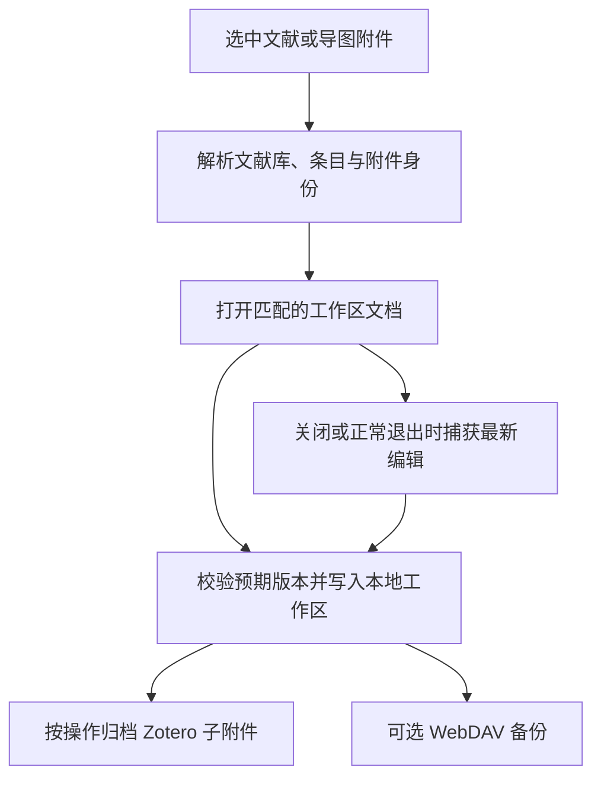
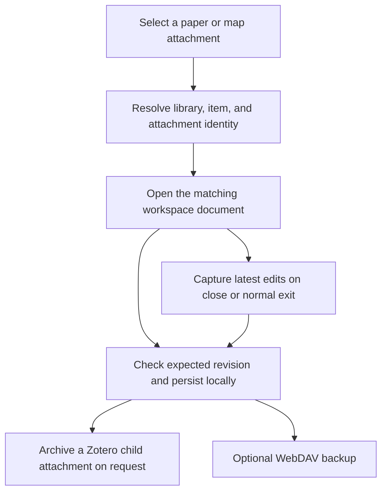

# MindFlow for Zotero — V10

**在 Zotero 中，把文献、批注与研究思路组织成可编辑的思维导图。**

**Turn papers, annotations, and research ideas into editable mind maps inside Zotero.**

[中文文档](#zh) · [English documentation](#en) · [Releases](https://github.com/groele/Mindflow-zotero/releases) · [Issues](https://github.com/groele/Mindflow-zotero/issues) · [审查与验证 / Audits and validation](docs/README.md)

| 项目 / Item | 当前状态 / Current status |
| --- | --- |
| 公开版本 / Public release | **10.0.5**, [v10.0.5](https://github.com/groele/Mindflow-zotero/releases/tag/v10.0.5) |
| 支持宿主 / Supported host | **Zotero 10.0.x**；原生回归环境为 Windows + Zotero 10.0.5 / Native regression environment: Windows + Zotero 10.0.5 |
| 插件 ID / Add-on ID | `mindflow@groele.org` |
| 许可 / License | [MIT](LICENSE) |

插件版本与 Zotero 版本分别管理。本 README 为中英文双语，当前工作台界面主要为中文。

The add-on and Zotero have separate version numbers. This README is bilingual; the current workspace interface is primarily in Chinese.

---

<a id="zh"></a>

## 中文文档

[安装](#zh-install) · [快速开始](#zh-start) · [功能](#zh-features) · [数据链路](#zh-data) · [AI 与 WebDAV](#zh-services) · [导入导出](#zh-formats) · [快捷键](#zh-shortcuts) · [常见问题](#zh-faq) · [开发](#zh-dev) · [验证](#zh-validation) · [反馈与许可](#zh-support)

<a id="zh-install"></a>

### 1. 安装与升级

1. 打开 [V10 Release](https://github.com/groele/Mindflow-zotero/releases/tag/v10.0.5)，下载 [`mindflow-zotero-10.0.5.xpi`](https://github.com/groele/Mindflow-zotero/releases/download/v10.0.5/mindflow-zotero-10.0.5.xpi)。请选择 XPI 安装包，GitHub 的 Source code ZIP 不能直接作为插件安装。
2. 在 Zotero 中打开 **工具 → 插件**，点击齿轮，选择 **从文件安装插件**。
3. 选择下载的 XPI，完成安装并重启 Zotero。
4. 通过文献库工具栏的 MindFlow 图标、工具菜单或分类右键菜单打开工作台。

升级前备份 Zotero 数据目录，并导出重要导图或完整工作区。V10 沿用 `mindflow@groele.org`，可以覆盖同 ID 的旧版本；升级本身不代表历史错误关联已被自动修正。

公开自动更新元数据为 [`update.json`](update.json) 与 [`zotero/update.json`](zotero/update.json)，目前指向 **10.0.5**。本版新增 12 项保存、备份与快照链路修复，见 [10.0.5 发布记录](docs/release-v10.0.5.md)。包含工具栏图标优化（图像尺寸为 **20 × 20 CSS 像素**，紧凑 SVG 视口）与 29 项操作逻辑审查与加固，详细见 [10.0.2 操作逻辑审查](docs/操作逻辑审查与修复-10.0.2.md) 与 [10.0.1 图标修复记录](docs/toolbar-icon-fix-10.0.1.md)。


*上图为在真实 Zotero 中的工具栏截图。*

<a id="zh-start"></a>

### 2. 从一篇文献开始

1. **选中文献。** 在文献列表选中目标论文，也可以从其 PDF 附件进入。
2. **打开 MindFlow。** 点击工具栏图标，或按 `Ctrl/Cmd + Alt + M`。已有一份关联导图时打开该导图；有多份时选择具体导图；没有时创建关联工作区。
3. **建立结构。** 以研究问题为根节点，用 `Tab` 添加子节点、`Enter` 添加同级节点，组织方法、证据、结论和后续问题。
4. **补充内容。** 导入笔记与批注，添加图片、任务、链接、节点备注和关系线；必要时切换到大纲编辑。
5. **检查保存状态。** 本地编辑保存到工作区；通过归档操作或 `Ctrl/Cmd + S` 将导图保存为 Zotero 文献的 `.mindflow` 子附件。AI 草稿需先审阅再明确归档。
6. **备份与分享。** 创建快照，导出工作区备份；按用途导出 Markdown、SVG、PNG 或交互 HTML。

工作台支持标签页与独立窗口，打开方式可在设置中调整。对于独立导图、文献合集和同一文献的多份导图，请确认当前文档及归档目标，避免把标题相似误当成同一文档。

<a id="zh-features"></a>

### 3. 功能概览

| 功能 | 使用方式与实际范围 |
| --- | --- |
| 画布与大纲 | 在图形画布与层级大纲之间组织节点；支持搜索替换、命令面板和小地图。 |
| 节点编辑 | 文本、任务、链接、图片与备注；复制粘贴、复制分支、折叠和移动。备注为纯文本。 |
| 布局与外观 | 思维导图、向右逻辑图、向下组织图；主题、节点形状和空白/点阵/网格背景。 |
| 任务管理 | 待办、进行中、完成状态，优先级、截止日期和进度。 |
| 图片 | PNG、JPEG、WebP 文件导入、粘贴和单文件拖入；图片数据随文档保存，会增加文件体积。 |
| 文档关联 | Zotero 文献关联、内部文档/节点链接、跨节点关系线、独立导图和合集导图。 |
| 文献整理 | 引入文献元数据、笔记、PDF 批注；可生成 Zotero 结构化大纲笔记。PDF 与导图附件分别保存。 |
| 阅读与演示 | 禅模式、子树聚焦、缩放适配与演示模式。 |
| 模板与收件箱 | 从模板开始，收集零散思路并整理到导图。 |
| 编辑撤销 | 默认最多 50 步节点编辑历史；它与持久化快照不同。 |
| 历史快照 | 自动与手动快照、预览和恢复；默认保留 20 份，可设置 10–50 份，默认自动间隔 10 分钟。 |
| AI 研读 | 用户配置服务后生成可编辑草稿，提供材料选择、预览、快速/深度研读与取消。 |
| WebDAV | 用户配置 HTTPS WebDAV 后上传、保留版本并恢复工作区备份。 |

当前社区实现开放上述功能，无需激活码。外部 AI 服务费用由所用服务决定。基础编辑使用随插件打包的脚本与样式，可以离线运行；AI、WebDAV 和 Zotero 远端文件同步需要网络。

<a id="zh-data"></a>

### 4. 数据归属、保存与恢复

#### 三种保存结果

| 操作 | 保存位置 | 如何理解成功状态 |
| --- | --- | --- |
| 本地工作区保存 | Zotero 数据目录下的 `mindflow/workspace` | 当前编辑已写入本地工作区；不等于 Zotero 已有导图附件。 |
| Zotero 附件归档 | 目标文献下的 `.mindflow` 子附件 | 已创建或更新文献关联文件；远端附件同步仍取决于 Zotero 的设置和服务。 |
| WebDAV 备份 | 用户配置的 WebDAV 目录 | 已上传工作区备份；不代表 Zotero 数据库或 PDF 已同步。 |

`.mindflow` 是论文父条目的子附件，与 PDF 平级，不能把 PDF 当作附件父条目。生成大纲笔记也是独立操作，其成功不代替导图附件归档成功。

没有单篇论文归属的独立或合集导图，归档到个人库的 **“MindFlow 独立导图”** 容器，不按当前选中文献或合集第一篇论文自动绑定。直接打开已有导图附件时，以该附件的实际来源为准。

#### 身份链路

| 身份 | 标识 | 作用 |
| --- | --- | --- |
| 文献 | 文献库 ID + 条目 key，或带库范围的 Zotero URI | 区分不同库与不同论文。 |
| 导图附件 | 文献库 ID + 附件 key | 区分同一论文的多份导图与不同物理附件。 |
| 工作区文档 | 本地文档 ID | 路由标签页、独立窗口、本地保存与恢复。 |
| 文档版本 | 当前 revision / 保存时的预期 revision | 阻止旧窗口覆盖较新的编辑。 |

标题、列表位置和导图内部 ID 都不能单独代替完整来源身份。复制得到的不同物理附件即使包含相同内部 ID，也应作为不同来源处理。


```mermaid
flowchart TD
    A[选中文献或导图附件] --> B[解析文献库、条目与附件身份]
    B --> C[打开匹配的工作区文档]
    C --> D[校验预期版本并写入本地工作区]
    D --> E[按操作归档 Zotero 子附件]
    D --> F[可选 WebDAV 备份]
    C --> G[关闭或正常退出时捕获最新编辑]
    G --> D
```

#### V10 对链路的修复

- 打开请求携带具体文献、附件与工作区身份；快速切换、标签页复用、独立窗口和会话恢复均核对实际文档。
- 保存、删除和归档由宿主统一串行处理；保存比较预期版本。旧窗口出现冲突时保留独立副本，避免覆盖新内容。
- 普通关闭及正常退出捕获最新编辑，包括仍处于编辑状态的节点文字；重启流程读取实际落盘内容。
- 删除记录保留逻辑删除标记，阻止旧窗口把已删除文档重新写回。
- 写入使用临时文件、备份、刷新与读取核对；载入验证文档结构、来源和快照归属，隔离损坏记录，允许匹配的有效备份恢复。

历史上已经归档到错误文献的文件仍需人工核对。系统无法仅凭相似标题可靠推断作者原本打算关联哪篇论文。

#### 快照与完整备份

快照用于回退单份导图的内容；编辑撤销用于当前编辑过程。完整工作区备份包含导图、收件箱和快照，**不包含设置与服务凭据，也不代替 Zotero 数据库、PDF 或完整数据目录备份**。

导入会先检查文件和结构。当前工作区备份导入限制为 **20 MiB**；节点数 **25,000**、深度 **256** 是结构保护上限，不是流畅性能保证。界面中的 50 MiB 存储参考值也不是文件系统硬性配额。含大量嵌入图片的导图需要特别留意体积。

恢复完整工作区时按文档提交，**不构成全部文件共同成功或失败的事务**。多窗口冲突副本、恢复预览和归档目标均应在覆盖已有研究内容前检查。

<a id="zh-services"></a>

### 5. 配置 AI 与 WebDAV

#### AI 研读

在设置中填写服务端点、模型和 API Key。服务需要兼容插件使用的 Chat Completions 请求；可选预设及参数兼容处理不保证所有服务提供商可用。PDF 页数限制可配置，默认最大处理页数为 120 页。

1. 选择论文及需要使用的摘要、PDF、笔记、划线或评论。
2. 查看发送预览中的服务主机、模型、材料数量与预计请求次数；打开本地预览本身不发送论文内容。
3. 明确开始快速或深度研读。未选择的材料不进入该次研读及其对应引用核对。
4. 检查生成草稿的结构、引用和论断，编辑后再明确归档到 Zotero。

取消会中止后续请求并尽可能终止进行中的请求，但服务可能已处理或计费已发送的请求。引用文本匹配用于帮助检查来源，**不证明科学结论正确**。扫描 PDF、缺少文本层或抽取失败的材料不保证可读，也不保证 OCR。

#### WebDAV 备份

在设置中配置 **HTTPS** 服务地址、备份目录、用户名和密码或应用专用密码。地址不应包含内嵌账号密码、查询参数或片段。先测试连接，再使用手动备份，或启用保存时自动备份。

备份以版本化工作区 JSON 保存；恢复前检查远端版本和恢复预览。WebDAV 是工作区备份机制，**不是实时多人协作，也不是 Zotero PDF 文件同步**。

#### 隐私与凭据

基础编辑不会要求外部 AI 或 WebDAV 账号。启用 AI 后，所选材料会发送到用户配置的服务；启用 WebDAV 后，工作区内容会上传到该服务器。请确认服务与机构的数据使用要求。

API Key 与 WebDAV 凭据保存在本地设置/宿主偏好中，当前没有应用层加密。完整工作区备份排除设置与凭据；HTTPS 保护传输，但插件不提供备份内容的端到端加密。请避免在 Issues、截图或日志中公开密钥和私有文献内容。

<a id="zh-formats"></a>

### 6. 导入与导出格式

支持导入 `.mindflow`、`.json`、`.md`、`.markdown` 和 `.opml`。导入会验证内容；复制导入得到的新工作区不应被当作原物理附件的归属证明。

| 导出格式 | 适合用途 | 保真范围与限制 |
| --- | --- | --- |
| MindFlow JSON（`.mindflow.json`） | 后续继续编辑单份导图 | 保留文档结构、关系与元数据；不包含整个 Zotero 文献库。 |
| 完整工作区备份 | 迁移和恢复工作区 | 包含导图、收件箱、快照；不包含设置、凭据和 Zotero PDF。 |
| Markdown | 文本整理、写作与版本管理 | 层级文字为主，不完整保留样式、关系与全部元数据。 |
| OPML | 与大纲工具交换层级 | 保留大纲层级，不等于完整工作区备份。 |
| SVG | 矢量图排版与分享 | 图形输出，不是可重新导入的完整可编辑导图。 |
| PNG | 图片分享与插图 | 栅格输出，不能恢复节点编辑结构。 |
| 交互 HTML | 离线浏览与分享 | 支持查看、缩放和平移，不是完整编辑器。 |
| PDF / 打印 | 打印或由宿主保存 PDF | 使用打印流程，默认横向页面和 10 mm 页边距；能否保存 PDF 取决于宿主打印对话框。 |

需要之后继续编辑时优先保存 MindFlow JSON 或工作区备份；需要论文原始文件时另行备份 Zotero 数据。

<a id="zh-shortcuts"></a>

### 7. 常用快捷键

`Ctrl/Cmd` 表示 Windows 的 `Ctrl` 或 macOS 的 `Command`。以下为当前实现；除宿主入口外，多数快捷键需要工作台拥有焦点，输入框或节点文字编辑状态可能接管按键。macOS 原生流程尚未验收。

| 快捷键 / 操作 | 功能 |
| --- | --- |
| `Ctrl/Cmd + Alt + M` | 从 Zotero 打开 MindFlow |
| `Tab` | 添加子节点 |
| `Enter` / `Shift + Enter` | 添加后方 / 前方同级节点 |
| `Space` / 双击节点 | 编辑节点文字 |
| 编辑时 `Enter` / `Esc` | 提交 / 取消本次文字编辑 |
| `Delete` / `Backspace` | 删除选中节点 |
| `Ctrl/Cmd + C` / `V` / `D` | 复制 / 粘贴 / 复制节点或分支 |
| `Ctrl/Cmd + Z` | 撤销 |
| `Ctrl/Cmd + Shift + Z` 或 `Ctrl/Cmd + Y` | 重做 |
| `Ctrl/Cmd + S` | 刷新本地保存并请求 Zotero 归档；AI 草稿需明确审阅归档 |
| `Ctrl/Cmd + F` / `K` | 搜索 / 命令面板 |
| `Ctrl/Cmd + ,` | 设置 |
| `Ctrl/Cmd + 1` / `0` | 适配画布 / 重置缩放 |
| `F5` | 演示模式 |
| 方向键 | 节点导航 |
| `?` | 快捷键帮助 |
| `Shift` + 拖动 | 框选节点 |
| 拖动画布空白处 / 中键拖动 | 平移画布 |
| `Ctrl/Cmd` + 滚轮 | 缩放画布 |

<a id="zh-faq"></a>

### 8. 常见问题与排查

**为什么选中文献 A，却看到另一张导图？**

先确认所选的是论文、PDF 还是导图附件，并查看是否弹出了多份导图选择器。核对当前工作区、实际附件及所属文献库。V10 已修复来源混淆与标签页复用链路，但历史错误关联不会凭标题自动纠正。若仍可复现，请记录“选中条目 → 入口 → 选择器 → 实际打开文档”的完整步骤。

**本地提示已保存，为什么文献下没有 `.mindflow`？**

本地保存与 Zotero 归档具有独立结果。执行归档并核对目标父条目、库写权限和附件结果；不能把本地保存成功当作附件或云端同步成功。

**附件缺失、损坏或需要下载怎么办？**

先在 Zotero 确认附件可访问并完成必要下载，再重试。插件会验证内容；不要用另一篇论文的导图替代损坏附件来掩盖归属问题。必要时使用对应文档的有效备份恢复。

**出现冲突副本或重复标题怎么办？**

通常意味着旧窗口与新窗口的版本不同。比较副本内容、来源与时间，手动决定保留或合并。不同文档可以同名，不能仅按标题去重。

**完整备份导入失败怎么办？**

检查文件类型、20 MiB 限制及结构错误。含大量图片时可分别导出导图并压缩图片体积；保留原始备份，记录报错，避免手动删除身份字段强行导入。

**为什么 WebDAV 备份后其他设备没有 PDF？**

WebDAV 备份包含 MindFlow 工作区内容；PDF 与 Zotero 数据库需通过 Zotero 的相应同步或备份流程处理。

**AI 没有结果、内容不完整或引用有误怎么办？**

检查端点、模型、密钥、服务返回错误、材料选择与 PDF 文本可读性。页数限制及服务上下文限制会影响材料覆盖。生成结果需回到原文人工核对。

**卸载插件会删除所有导图吗？**

卸载插件不是完整数据清理操作。工作区、文献附件和外部备份分属不同位置；需要清理时先备份，逐项确认后在对应系统中处理。

<a id="zh-dev"></a>

### 9. 开发、构建与打包

前端使用 React、TypeScript；Zotero 宿主负责窗口、身份路由、本地持久化、文献与附件操作。前端脚本和样式随 XPI 打包，不依赖外部 CDN 加载基础界面。

| 路径 | 职责 |
| --- | --- |
| [`source/src`](source/src) | 工作台 UI、画布、前端状态与服务 |
| [`chrome/content/scripts/index.js`](chrome/content/scripts/index.js) | Zotero 宿主集成与数据链路 |
| [`chrome/content/assets`](chrome/content/assets) | 构建后的前端脚本与样式 |
| [`chrome/content/icons`](chrome/content/icons) | 工具栏、菜单等图标 |
| [`bootstrap.js`](bootstrap.js) | 插件生命周期入口 |
| [`manifest.json`](manifest.json)、[`zotero/manifest.json`](zotero/manifest.json) | 插件身份与版本信息 |
| [`source/package.json`](source/package.json)、[`source/package-lock.json`](source/package-lock.json) | 前端依赖与锁文件 |
| [`scripts`](scripts) | 构建、打包、宿主与原生回归脚本 |
| [`docs`](docs/README.md) | 审查、发布记录与验证证据 |

已验证环境为 Windows、PowerShell 7、Node.js 22.14.0 与 Python 3。按锁文件安装依赖；以下命令从仓库根目录执行：

```powershell
npm ci --prefix source
node scripts/build-local.mjs
node --test scripts/test-host.mjs
& source/node_modules/.bin/vite-node.cmd source/tests/test-zotero.ts
python scripts/package-xpi.py
```

构建脚本执行 TypeScript 检查并生成 Zotero 使用的 IIFE/CSS。打包脚本读取当前清单版本生成 XPI；本地打包不会自动创建 Release，也不会自动更新公开下载通道。开发时不要手工修改构建产物代替源码修改。

真实桌面回归使用隔离配置、数据目录、论文和附件，默认 Zotero 路径为 `C:\Program Files\Zotero\zotero.exe`：

```powershell
pwsh -NoProfile -File scripts/start-native-test.ps1
# 等测试实例自行退出，检查 tests/current-native-test.json 所指目录中的结果后：
pwsh -NoProfile -File scripts/restart-native-test.ps1
```

测试从最终 XPI 提取生产代码，只在隔离配置中追加测试入口。测试入口不进入交付 XPI；结果位于 `tests/native-test-*`。当前构建与原生测试主要针对 Windows，不能据此声称已验证 macOS/Linux。

<a id="zh-validation"></a>

### 10. 验证结果与适用边界

公开 V10 的验证报告记录 **86 项通过**：

| 验证层 | 数量 | 覆盖重点 |
| --- | --- | --- |
| 宿主测试 | 36 | 身份、附件归档、保存队列、版本冲突与恢复 |
| 前端测试 | 24 | 文档解析、工作区打开与数据服务行为 |
| 真实 Zotero 流程 | 23 | 实际窗口、选择条目、切换、多导图、编辑与归档 |
| 真实进程重启 | 3 | 落盘数据、正常退出与重新载入 |

另外完成类型检查、生产构建、脚本语法与 XPI 内容核对。[V10 验证汇总](docs/validation-summary.json) 和 [安装包校验](docs/package-verification-10.0.0.json) 对应公开 **10.0.0**；[10.0.1 验证记录](docs/toolbar-icon-validation-10.0.1.json) 对应本地图标补丁，其 86 项回归也通过，并增加真实原生图标尺寸核对。

这些结果不能替代所有用户环境的验收。仍需实际验证的场景包括：真实群组库权限和远端附件同步、外部 AI/WebDAV 账户、macOS/Linux 原生流程、长期大文档压力、网络异常与强制断电恢复。正常关闭/退出测试不能作为突然断电时数据绝不丢失的保证。

<a id="zh-support"></a>

### 11. 审查记录、反馈与许可

- [文档索引](docs/README.md)：按阶段查找完整证据。
- [首轮审查与修复清单](docs/审查与修复清单.md)：42 项问题与改进。
- [全流程逻辑复审](docs/全流程逻辑复审-5.0.2.md)：28 项补充问题、身份链路与流程矩阵。
- [V10 发布记录](docs/release-v10.md)：公开版本的修复范围、安装与验证边界。
- [10.0.1 图标修复记录](docs/toolbar-icon-fix-10.0.1.md)：本地补丁与真实尺寸测量。

历史文档中的版本、校验值与未发布状态属于相应阶段；当前公开安装资产以 GitHub Release 为准。

在 [GitHub Issues](https://github.com/groele/Mindflow-zotero/issues) 提交反馈时，请提供插件版本、Zotero 版本、操作系统、入口、最短复现步骤、预期与实际结果，以及脱敏错误日志或最小示例导图。涉及串图时还需说明是否为不同库、同一文献多附件、复制导图、标签页/独立窗口或恢复操作。

代码采用 [MIT License](LICENSE)。论文、图片和第三方服务具有各自的权利与使用条款。

---

<a id="en"></a>

## English documentation

[Installation](#en-install) · [Quick start](#en-start) · [Features](#en-features) · [Data flow](#en-data) · [AI and WebDAV](#en-services) · [Import/export](#en-formats) · [Shortcuts](#en-shortcuts) · [FAQ](#en-faq) · [Development](#en-dev) · [Validation](#en-validation) · [Support and license](#en-support)

<a id="en-install"></a>

### 1. Installation and upgrades

1. Open the [V10 Release](https://github.com/groele/Mindflow-zotero/releases/tag/v10.0.5) and download [`mindflow-zotero-10.0.5.xpi`](https://github.com/groele/Mindflow-zotero/releases/download/v10.0.5/mindflow-zotero-10.0.5.xpi). Use the XPI asset; GitHub's Source code ZIP cannot be installed directly as the add-on.
2. In Zotero, open **Tools → Plugins**, click the gear button, and choose **Install Add-on From File**. Menu labels may vary with your Zotero language.
3. Select the XPI, finish installation, and restart Zotero.
4. Open MindFlow through its library toolbar icon, the Tools menu, or the collection's context menu.

Before upgrading, back up your Zotero data directory and export important maps or the complete workspace. V10 keeps the add-on ID `mindflow@groele.org` and can replace an older installation with that ID. Upgrading does not automatically repair attachments that were previously associated with the wrong paper.

The public update metadata in [`update.json`](update.json) and [`zotero/update.json`](zotero/update.json) currently points to **10.0.5**. This release adds 12 fixes for saving, backups, and snapshot restoration; see the [10.0.5 release report](docs/release-v10.0.5.md). It includes the toolbar icon fix (**20 × 20 CSS pixels**, tighter SVG viewport) and 29 workflow fixes and hardening items; see the [detailed audit](docs/操作逻辑审查与修复-10.0.2.md) and [toolbar fix report](docs/toolbar-icon-fix-10.0.1.md).

<a id="en-start"></a>

### 2. Start with a paper

1. **Select a paper.** Select the target paper in the library, or enter through its PDF attachment.
2. **Open MindFlow.** Click the toolbar icon or press `Ctrl/Cmd + Alt + M`. One existing associated map opens directly; multiple maps require a specific selection; otherwise, a linked workspace is created.
3. **Build a structure.** Put your research question at the root. Use `Tab` for a child and `Enter` for a sibling to organize methods, evidence, conclusions, and open questions.
4. **Add supporting content.** Import notes and annotations; add images, tasks, links, node notes, and relationship lines. Switch to outline editing when useful.
5. **Check the save state.** Local edits are persisted in the workspace. Use the archive action or `Ctrl/Cmd + S` to save a `.mindflow` child attachment under the Zotero paper. Review AI drafts before explicitly archiving them.
6. **Back up and share.** Create snapshots, export a workspace backup, and choose Markdown, SVG, PNG, or interactive HTML for the intended use.

The workspace supports tabs and separate windows; choose the opening mode in settings. For standalone maps, collection maps, or multiple maps under one paper, check the active document and archive destination. Similar titles do not establish document identity.

<a id="en-features"></a>

### 3. Feature overview

| Feature | Usage and actual scope |
| --- | --- |
| Canvas and outline | Organize nodes graphically or hierarchically; search/replace, command palette, and minimap are available. |
| Node editing | Text, task, link, image, and note nodes; copy/paste, duplicate branches, fold, and move. Node notes use plain text. |
| Layout and appearance | Mind map, rightward logic chart, and downward organization chart; themes, node shapes, and blank/dot/grid backgrounds. |
| Tasks | Todo, doing, and done states, priority, due date, and progress. |
| Images | Import PNG, JPEG, and WebP files, paste images, or drop a single file. Embedded image data increases document size. |
| Document associations | Zotero paper links, internal document/node links, relationship lines, standalone maps, and collection maps. |
| Literature organization | Bring in metadata, notes, and PDF annotations; generate a structured Zotero outline note. PDFs and map attachments remain separate files. |
| Reading and presentation | Zen mode, subtree focus, fit/zoom, and presentation mode. |
| Templates and inbox | Start from a template and collect loose ideas before organizing them into maps. |
| Editing undo | Up to 50 node-editing steps by default; separate from persistent snapshots. |
| Snapshots | Automatic/manual snapshots, preview, and restore; 20 retained by default, configurable from 10–50, with a default automatic interval of 10 minutes. |
| AI reading | User-configured services produce editable drafts, with material selection, request preview, quick/deep modes, and cancellation. |
| WebDAV | Upload, retain versions, and restore workspace backups through a user-configured HTTPS service. |

The current community implementation enables these features without an activation code. External AI services may charge their own fees. Basic editing uses bundled scripts and styles and works offline; AI, WebDAV, and Zotero remote file synchronization require a network connection.

<a id="en-data"></a>

### 4. Ownership, persistence, and recovery

#### Three distinct save results

| Operation | Destination | What success means |
| --- | --- | --- |
| Local workspace save | `mindflow/workspace` inside the Zotero data directory | The current edits have reached the local workspace; this does not establish a Zotero map attachment. |
| Zotero attachment archive | A `.mindflow` child attachment under the target paper | The associated file was created or updated; remote attachment synchronization depends on Zotero settings and services. |
| WebDAV backup | The configured WebDAV directory | A workspace backup was uploaded; this does not establish database or PDF synchronization. |

A `.mindflow` file belongs under the paper's parent item, alongside its PDF. A PDF attachment cannot serve as its parent. Creating an outline note is also a separate operation and does not establish successful map archiving.

Standalone or collection maps without a single-paper owner archive under the **“MindFlow 独立导图” (MindFlow standalone maps)** container in the personal library. They are not automatically assigned to the currently selected paper or the first paper in a collection. Opening an existing map attachment uses that attachment's actual source.

#### Identity chain

| Identity | Identifier | Purpose |
| --- | --- | --- |
| Paper | Library ID + item key, or a library-scoped Zotero URI | Distinguishes papers and libraries. |
| Map attachment | Library ID + attachment key | Distinguishes physical files and multiple maps under one paper. |
| Workspace document | Local document ID | Routes tabs, separate windows, local persistence, and recovery. |
| Document revision | Current revision / expected revision during save | Prevents stale windows from overwriting newer edits. |

Titles, list positions, and embedded map IDs cannot independently replace the complete source identity. Different physical attachments copied from the same map may share an embedded ID and must still be treated as different sources.


```mermaid
flowchart TD
    A[Select a paper or map attachment] --> B[Resolve library, item, and attachment identity]
    B --> C[Open the matching workspace document]
    C --> D[Check expected revision and persist locally]
    D --> E[Archive a Zotero child attachment on request]
    D --> F[Optional WebDAV backup]
    C --> G[Capture latest edits on close or normal exit]
    G --> D
```

#### V10 data-flow fixes

- Open requests carry paper, attachment, and workspace identity. Rapid switching, reused tabs, separate windows, and session restoration check the actual document.
- The host serializes saves, deletion, and archiving and compares expected revisions. Stale edits are retained in separate conflict copies instead of overwriting newer content.
- Ordinary close and normal application exit capture the latest edits, including node text still being edited. Restart checks read the actual persisted data.
- Logical deletion markers prevent stale windows from writing deleted documents back into the workspace.
- Persistence uses temporary files, backups, flushes, and read-back checks. Loading validates structure, provenance, and snapshot ownership, isolates corrupt records, and permits recovery from matching valid backups.

Files historically archived under the wrong paper still require manual review. Similar titles cannot reliably reveal the author's intended association.

#### Snapshots and full backups

Snapshots roll back an individual map; editing undo covers the active editing session. A complete workspace backup includes maps, inbox items, and snapshots. **It excludes settings and service credentials and does not replace a Zotero database, PDF, or complete data-directory backup.**

Imports validate the file and its structure first. Workspace backup imports currently have a **20 MiB** size limit. The limits of **25,000 nodes** and **256 levels** are structural safeguards, not smooth-performance guarantees. The 50 MiB storage reference displayed in the interface is not a filesystem quota. Maps with many embedded images need particular attention to size.

Full-workspace restoration commits documents individually; **it is not a single all-or-nothing transaction across every file**. Inspect conflict copies, recovery previews, and archive destinations before replacing existing research content.

<a id="en-services"></a>

### 5. Configure AI and WebDAV

#### AI reading

Enter a service endpoint, model, and API key in settings. The service must support the Chat Completions requests used by the add-on; presets and parameter compatibility handling do not guarantee support for every provider. The configurable PDF page limit defaults to 120 pages.

1. Select the paper and the abstract, PDF, notes, highlights, or comments to use.
2. Inspect the local preview for the service host, model, material counts, and estimated request count. Opening the preview alone does not transmit paper content.
3. Explicitly start quick or deep reading. Unselected materials are excluded from that reading run and its associated quotation checks.
4. Review the draft's structure, quotations, and claims, then edit it before explicitly archiving to Zotero.

Cancellation stops subsequent requests and attempts to abort active ones, but a service may already have processed or charged for transmitted requests. Matching quoted text helps check provenance; **it does not prove a scientific claim**. Scanned PDFs, missing text layers, or extraction failures may prevent reading; OCR is not guaranteed.

#### WebDAV backup

Configure an **HTTPS** URL, backup folder, username, and password or application password. The URL must not contain embedded credentials, query parameters, or a fragment. Test the connection, then use manual backup or enable automatic backup on save.

Backups use versioned workspace JSON files. Check the remote version and restore preview before recovery. WebDAV provides workspace backup; **it is not real-time collaboration or Zotero PDF synchronization**.

#### Privacy and credentials

Basic editing does not require an external AI or WebDAV account. When AI is enabled, selected materials are sent to the configured service. WebDAV uploads workspace content to the configured server. Check the service's and your institution's data-use requirements.

API keys and WebDAV credentials are stored in local settings/host preferences without application-layer encryption. Complete workspace backups exclude settings and credentials. HTTPS protects transport, but the add-on does not provide end-to-end encryption for backup contents. Do not publish keys or private paper content in Issues, screenshots, or logs.

<a id="en-formats"></a>

### 6. Import and export formats

Imports support `.mindflow`, `.json`, `.md`, `.markdown`, and `.opml`, with content validation. A workspace created by importing a copy is not proof of ownership of the original physical attachment.

| Export | Suitable use | Fidelity and limitations |
| --- | --- | --- |
| MindFlow JSON (`.mindflow.json`) | Continue editing an individual map | Preserves document structure, relationships, and metadata; does not include the entire Zotero library. |
| Full workspace backup | Workspace migration and recovery | Includes maps, inbox, and snapshots; excludes settings, credentials, and Zotero PDFs. |
| Markdown | Text organization, writing, and version control | Primarily hierarchical text; does not preserve all styles, relationships, or metadata. |
| OPML | Exchange hierarchies with outline tools | Preserves outline hierarchy; not a complete workspace backup. |
| SVG | Vector illustrations and sharing | Graphical output; not a complete editable map that can be re-imported. |
| PNG | Image sharing and illustrations | Raster output; does not restore editable nodes. |
| Interactive HTML | Offline viewing and sharing | Viewing, zooming, and panning; not the complete editor. |
| PDF / printing | Print or save PDF through the host | Uses the print workflow, with landscape pages and 10 mm margins by default; saving PDF depends on the host print dialog. |

Use MindFlow JSON or a workspace backup for further editing. Back up Zotero separately when you need the original paper files.

<a id="en-shortcuts"></a>

### 7. Common shortcuts

`Ctrl/Cmd` means `Ctrl` on Windows or `Command` on macOS. These bindings reflect the current implementation. Most require workspace focus; text inputs and active node editing may capture the keys. Native macOS workflows have not yet been validated.

| Shortcut / action | Function |
| --- | --- |
| `Ctrl/Cmd + Alt + M` | Open MindFlow from Zotero |
| `Tab` | Add a child node |
| `Enter` / `Shift + Enter` | Add a following / preceding sibling |
| `Space` / double-click a node | Edit node text |
| `Enter` / `Esc` while editing | Commit / cancel the text edit |
| `Delete` / `Backspace` | Delete selected nodes |
| `Ctrl/Cmd + C` / `V` / `D` | Copy / paste / duplicate a node or branch |
| `Ctrl/Cmd + Z` | Undo |
| `Ctrl/Cmd + Shift + Z` or `Ctrl/Cmd + Y` | Redo |
| `Ctrl/Cmd + S` | Flush local persistence and request Zotero archiving; AI drafts require explicit review and archiving |
| `Ctrl/Cmd + F` / `K` | Search / command palette |
| `Ctrl/Cmd + ,` | Settings |
| `Ctrl/Cmd + 1` / `0` | Fit the canvas / reset zoom |
| `F5` | Presentation mode |
| Arrow keys | Navigate nodes |
| `?` | Shortcut help |
| `Shift` + drag | Marquee selection |
| Drag the canvas background / middle-button drag | Pan |
| `Ctrl/Cmd` + mouse wheel | Zoom |

<a id="en-faq"></a>

### 8. FAQ and troubleshooting

**Why does selecting paper A show another map?**

Check whether the selection is a paper, PDF, or map attachment and whether a multiple-map chooser appeared. Inspect the active workspace, actual attachment, and library. V10 fixes source confusion and reused-tab routing, but historical incorrect associations are not automatically corrected by title. If reproducible, record the full sequence: selected item → entry point → chooser → actual opened document.

**Why is there no `.mindflow` attachment after “saved locally”?**

Local persistence and Zotero archiving have independent results. Archive the map and check the target parent item, library write permissions, and attachment result. Local save success does not establish attachment or cloud-sync success.

**What if an attachment is missing, corrupt, or needs downloading?**

Check access in Zotero and complete any required download before retrying. The add-on validates content. Do not substitute a different paper's map for the broken attachment. If necessary, recover from a valid backup belonging to the same document.

**What should I do with conflict copies or duplicate titles?**

A conflict commonly indicates different revisions in old and new windows. Compare content, source, and time, then decide what to retain or merge. Different documents can share a title; titles alone cannot establish duplicates.

**Why does a full backup fail to import?**

Check the file type, the 20 MiB limit, and structural errors. For image-heavy workspaces, export maps individually and reduce image sizes. Retain the original backup and report the error rather than deleting identity fields to force an import.

**Why are PDFs missing on another device after WebDAV backup?**

The backup covers MindFlow workspace content. Zotero PDFs and its database require their respective synchronization or backup workflows.

**What if AI returns no result, misses content, or gives incorrect quotations?**

Check endpoint, model, key, service errors, selected materials, and PDF text readability. Page limits and service context limits affect coverage. Verify generated claims against the original paper.

**Does uninstalling remove every map?**

Uninstalling is not a complete data-cleanup operation. Workspace files, Zotero attachments, and external backups occupy different locations. Back up first, then handle each location explicitly if cleanup is intended.

<a id="en-dev"></a>

### 9. Development, build, and packaging

The frontend uses React and TypeScript. The Zotero host handles windows, identity routing, local persistence, and paper/attachment operations. Frontend scripts and styles are bundled in the XPI; basic UI loading does not depend on an external CDN.

| Path | Responsibility |
| --- | --- |
| [`source/src`](source/src) | Workspace UI, canvas, frontend state, and services |
| [`chrome/content/scripts/index.js`](chrome/content/scripts/index.js) | Zotero host integration and data flow |
| [`chrome/content/assets`](chrome/content/assets) | Built frontend scripts and styles |
| [`chrome/content/icons`](chrome/content/icons) | Toolbar and other icons |
| [`bootstrap.js`](bootstrap.js) | Add-on lifecycle entry point |
| [`manifest.json`](manifest.json), [`zotero/manifest.json`](zotero/manifest.json) | Add-on identity and version |
| [`source/package.json`](source/package.json), [`source/package-lock.json`](source/package-lock.json) | Frontend dependencies and lockfile |
| [`scripts`](scripts) | Build, packaging, host tests, and native regression tools |
| [`docs`](docs/README.md) | Audits, release reports, and validation evidence |

The validated environment uses Windows, PowerShell 7, Node.js 22.14.0, and Python 3. Install dependencies from the lockfile. Run these commands from the repository root:

```powershell
npm ci --prefix source
node scripts/build-local.mjs
node --test scripts/test-host.mjs
& source/node_modules/.bin/vite-node.cmd source/tests/test-zotero.ts
python scripts/package-xpi.py
```

The build script checks TypeScript and generates the Zotero IIFE/CSS. Packaging reads the current manifest version to produce an XPI; it does not automatically create a Release or change public update downloads. Edit source files rather than replacing source changes with hand-edited build output.

Native desktop regression uses isolated profiles, data directories, papers, and attachments. Its default Zotero executable is `C:\Program Files\Zotero\zotero.exe`:

```powershell
pwsh -NoProfile -File scripts/start-native-test.ps1
# After the test instance exits, inspect results under the path in tests/current-native-test.json:
pwsh -NoProfile -File scripts/restart-native-test.ps1
```

Tests extract production code from the final XPI and add a test entry point only within the isolated profile. The test entry point is excluded from the delivered XPI. Results reside under `tests/native-test-*`. Current build and native testing primarily target Windows and do not establish macOS/Linux validation.

<a id="en-validation"></a>

### 10. Validation results and boundaries

The public V10 reports record **86 passing checks**:

| Layer | Count | Main coverage |
| --- | --- | --- |
| Host tests | 36 | Identity, attachment archiving, save queue, revision conflicts, and recovery |
| Frontend tests | 24 | Document parsing, workspace opening, and data-service behavior |
| Real Zotero workflows | 23 | Actual windows, item selection, switching, multiple maps, editing, and archiving |
| Real process restart | 3 | Persisted data, normal exit, and reloading |

Type checking, production build, script syntax, and XPI contents were also checked. The [V10 validation summary](docs/validation-summary.json) and [package verification](docs/package-verification-10.0.0.json) describe public **10.0.0**. The [10.0.1 validation report](docs/toolbar-icon-validation-10.0.1.json) describes the local toolbar patch, which also passed the 86 checks and adds native icon-size comparison.

These results do not replace acceptance testing in every user environment. Remaining scenarios include real group-library permissions and remote attachment synchronization, external AI/WebDAV accounts, native macOS/Linux workflows, sustained large-document workloads, network failures, and forced power-loss recovery. Normal close/exit testing cannot guarantee zero data loss after sudden power failure.

<a id="en-support"></a>

### 11. Audit records, support, and license

- [Documentation index](docs/README.md): evidence organized by development stage.
- [Initial audit and repair checklist](docs/审查与修复清单.md): 42 issues and improvements.
- [Full workflow re-audit](docs/全流程逻辑复审-5.0.2.md): 28 additional issues, identity chain, and workflow matrix.
- [V10 release report](docs/release-v10.md): public fixes, installation, and validation boundaries.
- [10.0.1 toolbar fix](docs/toolbar-icon-fix-10.0.1.md): local patch and native measurements.

Version numbers, hashes, and unpublished status in historical documents belong to their respective stages. Use GitHub Releases to identify current public installation assets. The detailed audit reports are currently written in Chinese.

When opening a [GitHub Issue](https://github.com/groele/Mindflow-zotero/issues), provide the add-on version, Zotero version, operating system, entry point, minimal reproduction steps, expected/actual behavior, and sanitized errors or a minimal example map. For incorrect-map opening, state whether it involves different libraries, multiple attachments under one paper, copied maps, tabs/separate windows, or restoration.

The code is distributed under the [MIT License](LICENSE). Papers, images, and third-party services retain their own rights and terms.
