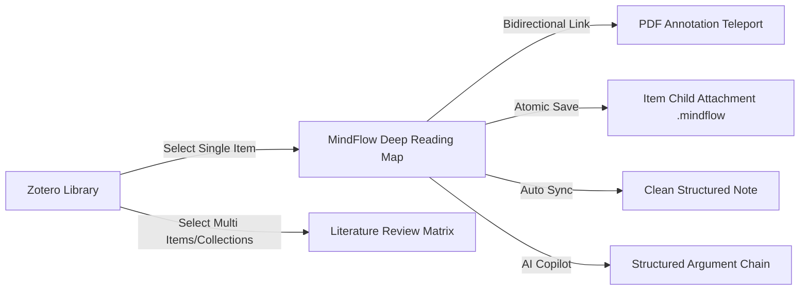

# MindFlow for Zotero

<div align="center">


# MindFlow for Zotero
### Modern, Elegant Mind-Mapping & Literature Research Companion for Academic Scholars

[简体中文](README.md) • **English** • [English Documentation](README_EN.md)

[](https://github.com/groele/Mindflow-zotero)
[](zotero/manifest.json)
[](package.json)
[](tsconfig.json)
[](scripts/build-zotero.mjs)
[](LICENSE)

[Quick Install](#-installation--quick-start) • [v200 Highlights](#-v200-major-release-milestones) • [Feature Matrix](#-core-feature-matrix) • [Workflows](#-scholarly-research-workflows) • [Storage Architecture](#-resilient-3-tier-storage-architecture) • [AI Literature Copilot](#-ai-literature-copilot) • [Shortcuts](#-keyboard-shortcuts) • [Build from Source](#-building-from-source)

</div>

---

## 📖 Introduction

**MindFlow for Zotero** is a next-generation academic mind-mapping and visual knowledge organization tool designed specifically for the **Zotero 10** ecosystem.

In traditional scholarly research, bibliographic metadata, PDF highlights, and reading notes often remain siloed across disparate panels. **MindFlow** transforms research workflows by automatically consolidating bibliographic records (authors, publication year, journal, DOI), core abstracts, annotations, and notes into an intuitive, bidirectional, and interactive visual graph:
- Mind map source files are securely archived as **direct child attachments** (`.mindflow` files, alongside PDFs) under the parent literature item;
- Synchronizes clean, structured **outline notes (HTML Rich Text Notes)** without duplicate text;
- Instant bidirectional navigation: click any annotation node to teleport directly to the corresponding page and highlighted quote in the Zotero PDF reader;
- Built-in AI academic copilot to deconstruct complex arguments, claims, and experimental evidence chains.

---

## 🚀 v2.0.0 Major Release Milestones

As a landmark release in MindFlow's evolution, **v2.0.0** introduces architectural overhauls and a polished visual identity:

### 1. 🎨 New MapGraph (Astronomical Topology) Brand Identity
- Features a subtle gradient frosted-glass squircle base, vibrant knowledge nucleus, and an 8-directional radial topology network;
- Sub-pixel supersampled signed distance field (SDF) anti-aliasing ensures razor-sharp clarity in Zotero's **16×16 px** toolbar.

### 2. 🛡️ Resilient Child Attachment Storage Architecture
- **Direct Item Child Attachments**: Resolves archive positioning ambiguity; maps are strictly preserved as direct child attachments under their parent literature item (co-equal with PDFs);
- **Triple-redundancy Safety**: Maps are stored in the local data directory `mindflow/workspace/` with **atomic replacement via temporary files**, **post-write readback verification**, and automatic **`.bak` disaster recovery snapshots**;
- **Accurate State Telemetry**: Eliminates false "Saved" alerts before host handshakes and physical disk flush are confirmed.

### 3. 💡 Purified Single-Abstract Note Generation
- **Eliminated Duplicate Abstracts**: Completely resolves the duplicate abstract bug where both the root title and child branches repeated the abstract text;
- **Clean Structural Grouping**: Root nodes focus strictly on paper title and metadata, while abstracts are housed in a dedicated `💡 Core Abstract` branch;
- **Outline Preview Filtering**: Automatically skips truncated preview sub-items in the generated Zotero outline note.

### 4. 📑 Context-Aware Multi-Tab Isolation
- Tracks active Zotero Item URIs and Reader tab IDs with a strict finite-state engine;
- Eliminates cross-item confusion and overwriting when switching between multiple papers and mind map tabs.

### 5. 🖋️ Card Layout & Academic Typography Refinement
- Expanded root card max-width to 520px to comfortably display extensive academic titles from top journals and conferences;
- Removed distracting tag pills and unnecessary virtual branches to maintain focus on core research logic.

---

## ✨ Core Feature Matrix

| Functional Module | Capability Description | Academic Value |
| :--- | :--- | :--- |
| **Native Zotero Integration** | Main toolbar button, context menu, reader top bar, and item details sidebar panel | Unobtrusive, native workflow inside Zotero without third-party app switching |
| **All-Keyboard Navigation** | `Tab` for child node, `Enter` for sibling node, `Space` for inline editing | Fluid, distraction-free flow state for rapid synthesis |
| **Bi-directional PDF Jump** | Annotation nodes retain exact page indexes and highlight anchors; single-click jumps to the source PDF line | Seamless verification of claims against original text |
| **Flexible Layout Engines** | Balanced Mind Map (left/right), Logic Chart (rightwards), and Org Chart (downwards) | Adapts to literature reviews, hypothesis testing, and conceptual trees |
| **AI Academic Copilot** | Compatible with OpenAI, DeepSeek, Claude, and local Ollama models via standard endpoints | Automatically structures papers into Problem $\to$ Hypothesis $\to$ Method $\to$ Evidence $\to$ Limits |
| **Versatile Export Formats** | `.mindflow`, JSON, Markdown, OPML, High-Res PNG, Vector SVG, and Interactive Standalone HTML | Effortlessly embed into Obsidian, Notion, or slides |
| **3-Tier Storage Defense** | Local atomic workspace + Zotero synced child attachments + Independent WebDAV backups | Immune to crashes, power failures, or sync race conditions |

---

## 📥 Installation & Quick Start

### Requirements
- **Zotero 10.0.x** (Windows / macOS / Linux).

### Installation Steps
1. Navigate to GitHub [Releases](https://github.com/groele/Mindflow-zotero/releases) and download the latest release bundle:
   ```text
   mindflow-zotero-2.0.0.xpi
   ```
2. Open Zotero 10 and select **Tools → Add-ons** from the top menu bar;
3. Click the gear icon in the top-right corner of the Add-ons Manager and select **Install Add-on From File...**;
4. Choose the downloaded `mindflow-zotero-2.0.0.xpi` file and confirm installation;
5. **Restart Zotero** to activate the extension.

### Access Points
- **Main Toolbar**: Click the MapGraph icon in the Zotero top toolbar;
- **Context Menu**: Right-click any literature item $\to$ choose **MindFlow → Generate/Open Mind Map**;
- **Item Sidebar**: Expand the **MindFlow Mind Map** section in the right-hand metadata pane;
- **Global Shortcut**: Press `Ctrl+Alt+M` (or `Cmd+Alt+M` on macOS).

---

## 🔄 Scholarly Research Workflows



### Workflow 1: Single-Paper Deep Reading & Critical Analysis
1. Select a paper in Zotero, right-click and choose **MindFlow Mind Map**;
2. Metadata, abstract, and existing PDF annotations are synthesized into a coherent visual tree;
3. Rearrange nodes, adjust hierarchy, and establish cross-branch relationships;
4. Click `[Link]` on any annotation node to teleport directly to the highlighted sentence in the PDF;
5. Press `Ctrl+S` to save both locally and as a `.mindflow` child attachment.

### Workflow 2: Cross-Paper Literature Review & Evidence Matrix
1. Select multiple papers in a collection and trigger MindFlow;
2. Generates a comparative matrix where each branch links back to its corresponding Zotero record;
3. The review map is saved into the personal library's `MindFlow | Standalone Maps` container without cluttering individual paper attachments.

### Workflow 3: AI-Assisted Deconstruction
1. Configure model credentials in **Preferences → MindFlow → AI Literature Map**;
2. Right-click any paper and select **AI Deconstruct Paper & Generate Map**;
3. Locally extracts paper text, displays a privacy preview, and sends selected passages;
4. Generates an evidence-backed knowledge tree mapping out claims, methodology, findings, and limitations.

---

## 🔒 Resilient 3-Tier Storage Architecture

MindFlow replaces fragile in-memory caches with an industrial-grade **3-tier storage architecture**:

| Storage Layer | Medium & Path | Purpose & Mechanism | Sync Mechanism |
| :--- | :--- | :--- | :--- |
| **Tier 1: Local Workspace** | `[ZoteroData]/mindflow/workspace/` | Atomic write, readback verification, `.bak` snapshot rotation | High-speed local access & crash protection |
| **Tier 2: Item Child Attachment** | `.mindflow` file under the Zotero item | First-class research asset bound to the paper | Roams via official Zotero File Sync (Zotero Storage / WebDAV) |
| **Tier 3: Structured Outline Note** | HTML Rich Text Child Note | Human-readable, full-text searchable outline | Roams via Zotero Data Sync |

---

## ⌨️ Keyboard Shortcuts

| Shortcut | Action | Shortcut | Action |
| :--- | :--- | :--- | :--- |
| `Tab` | Insert Child Node | `Enter` | Insert Sibling Node |
| `Space` / Double Click | Edit Node Text | `Delete` / `Backspace` | Delete Selected Node |
| `Ctrl/Cmd + S` | Save & Archive to Item | `Ctrl/Cmd + Z` / `Y` | Undo / Redo |
| `Ctrl/Cmd + F` | Search & Replace Nodes | `Ctrl/Cmd + K` | Quick Command Palette |
| `Ctrl/Cmd + 1` | Zoom to Fit All Nodes | `Ctrl/Cmd + 0` | Reset Zoom to 100% |
| `F11` | Immersive Fullscreen Mode | `Ctrl/Cmd + Alt + M` | Toggle MindFlow from Zotero |

---

## 🛠️ Building from Source

The project is built on **Vite + React 19 + TypeScript + Tailwind CSS**, compiled through a dedicated pipeline into a Gecko-compatible IIFE bundle.

### Prerequisites
- Node.js >= 18.0.0
- npm >= 9.0.0
- PowerShell 7 (`pwsh`)

### Build Commands
```powershell
# Clone the repository
git clone https://github.com/groele/Mindflow-zotero.git
cd Mindflow-zotero

# Install dependencies
npm ci

# Build Gecko IIFE bundle and package XPI
npm run build:zotero
```

The compiled add-on will be available at:
```text
dist-zip/mindflow-zotero-2.0.0.xpi
```

---

## ❓ Frequently Asked Questions (FAQ)

<details>
<summary><b>Q1: Cannot find MindFlow entry after installation?</b></summary>
Ensure you are running Zotero 10.0.x. Restart Zotero completely after installing the XPI. Right-click a regular item in your library to verify the context menu entry.
</details>

<details>
<summary><b>Q2: Will outline notes still contain duplicate abstracts?</b></summary>
No. In v2.0.0, the outline rendering pipeline has been rewritten to ensure abstracts only appear once in a dedicated "Core Abstract" branch.
</details>

<details>
<summary><b>Q3: How do I sync mind maps to a new computer?</b></summary>
As long as Zotero file sync is configured on your account, the <code>.mindflow</code> child attachment will synchronize automatically. Double-click the attachment on your new device to open it.
</details>

---

## 📄 License

This project is licensed under the [MIT License](LICENSE). Contributions, bug reports, and suggestions from fellow scholars are warmly welcomed!
